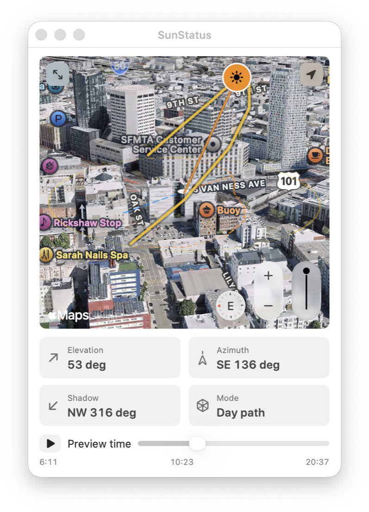
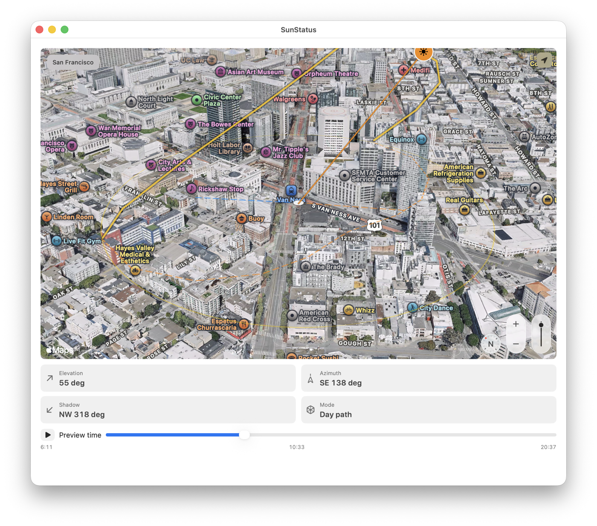

# SunStatus

[](https://buymeacoffee.com/tannermleoy)

SunStatus is a native macOS menu bar app for understanding the sun at a glance: where it is in its daily arc, how long until the next daylight transition, and how bright the outside light is likely to feel.

<p align="center">
  
</p>

<p align="center">
  
</p>

## Key Features

- Native macOS menu bar app with a compact countdown status item, popover, pinned widget, and expanded map window.
- Real solar-position calculations for the selected coordinate, including sunrise, solar noon, sunset, elevation, azimuth, and daylight progress.
- Apple Maps 3D satellite terrain view with realistic elevation, pitch, rotation, zoom, compass, and map controls.
- 3D sun path overlay with Mercator-aware projection correction so the arc stays aligned as the map pans.
- Dashed 2D ground projections for the sun path and current sun direction, plus current shadow bearing and terrain-projected location rings.
- Current-location centering for the widget and expanded map, with status text and solar geometry refreshed for the resolved coordinate.
- Slowly rotating compact 3D widget camera that pauses for 30 seconds when the user interacts with the map.
- Time scrubber for previewing the day path, elevation, azimuth, shadow direction, and brightness at different moments.
- Weather-enriched brightness using Open-Meteo cloud cover, UV index, visibility, and interpolated hourly cloud-cover samples.
- Release and local-run scripts that generate the app bundle icon from `Assets/AppIcon.png`.

## Requirements

- macOS 14 or newer.
- Xcode with Swift 6 support.

## Install

Install SunStatus with Homebrew once the tap has been published:

```sh
brew tap discolotus/sunstatus
brew install --cask discolotus/sunstatus/sunstatus
```

Or download `SunStatus.dmg` from the matching GitHub release, open it, and drag `SunStatus.app` to Applications.

SunStatus is currently ad-hoc signed rather than Developer ID signed and notarized. On first launch, macOS may require Control-click > Open or approval in System Settings > Privacy & Security.

## Support

SunStatus is free while the release candidate matures. If the app is useful to you, you can support development through [GitHub Sponsors](https://github.com/sponsors/discolotus) or [Buy Me a Coffee](https://buymeacoffee.com/tannermleoy). The in-app Settings window includes both support links.

To finish setup:

- Enable GitHub Sponsors for the `discolotus` account or organization.
- Create a Buy Me a Coffee creator page with the `tannermleoy` handle, or update `.github/FUNDING.yml` and `SupportLinks.swift` if you choose a different handle.
- In the GitHub repository settings, enable Sponsorships so GitHub displays the Sponsor button from `.github/FUNDING.yml`.

## Run Locally

Run the Swift package executable directly:

```sh
swift run SunStatus
```

Or launch a local app bundle with the same icon metadata used by release builds:

```sh
script/build_and_run.sh --verify --demo --pin --angled-map
```

Useful local flags:

- `--pin` opens the pinned widget window.
- `--map` or `--expanded-map` opens the expanded map window.
- `--demo` uses deterministic demo status data.
- `--readme-screenshots` or `--generic-location` prevents the map from following or displaying the machine's current location.
- `--angled-map`, `--wide-map`, and `--close-map` adjust the launch camera for visual QA.

## Test

```sh
swift test
```

## Build Release Artifacts

Build release artifacts locally:

```sh
scripts/build-release.sh 0.4.0
```

The script outputs `.build/release/SunStatus.zip` and `.build/release/SunStatus.dmg`, generates `Resources/AppIcon.icns` from `Assets/AppIcon.png`, codesigns the bundle ad hoc, mounts and verifies the DMG contents, and prints SHA-256 checksums.

After building a release locally, update the Homebrew cask with the DMG checksum:

```sh
scripts/update-homebrew-cask.sh 0.4.0 <SunStatus.dmg sha256>
```

Tagged GitHub releases publish `.zip`, `.dmg`, `SHA256SUMS`, and a cask patch. The `discolotus/homebrew-sunstatus` tap also runs an hourly sync that updates the cask from the latest SunStatus release. For immediate tap updates after a release, configure the `HOMEBREW_TAP_TOKEN` repository secret with a fine-grained GitHub token for `discolotus/homebrew-sunstatus` that has Actions read/write permission.

## App Icon

The source app icon is tracked at `Assets/AppIcon.png`. Both `scripts/build-release.sh` and `script/build_and_run.sh` generate the required `.icns` bundle resource from that image, and the app bundle sets `CFBundleIconFile` to `AppIcon`.

## Project Status

SunStatus is preparing a map-focused release candidate. The core app, real astronomy engine, current-location support, Open-Meteo weather enrichment, MapKit 3D overlays, zip/DMG release script, Homebrew cask template, tap sync workflow, and test suite are in place. Remaining distribution work is mainly Developer ID signing and notarization.

See [CHANGELOG.md](CHANGELOG.md) for release notes and [ROADMAP.md](ROADMAP.md) for the longer implementation plan.
