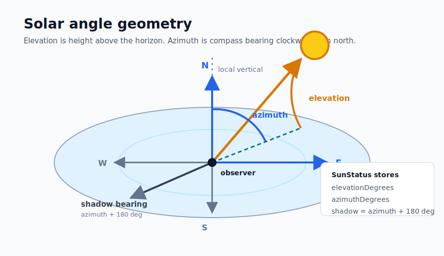
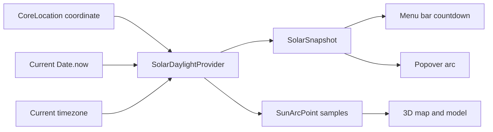
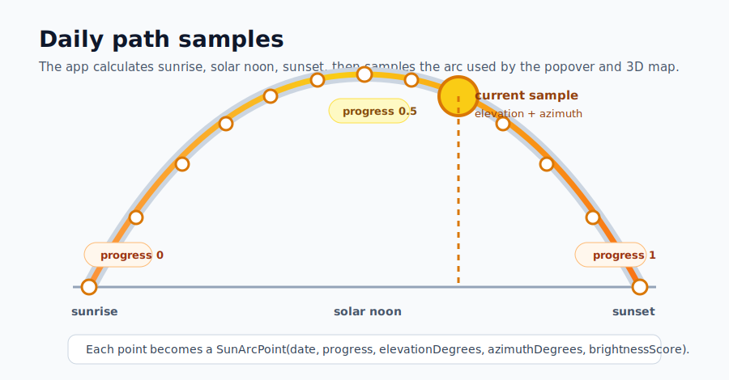

# Solar Angle Calculations

SunStatus calculates sun angles locally. There is no sun-position network API in the current implementation: the app reads a coordinate from CoreLocation, pairs it with the current timestamp and timezone, then runs deterministic astronomy equations in `SunStatusCore`.

The implementation lives in [`SolarDaylightProvider.swift`](../Sources/SunStatusCore/SolarDaylightProvider.swift), and the live app wires it through [`LocationAwareDaylightProvider.swift`](../Sources/SunStatus/LocationAwareDaylightProvider.swift).

## What The Angles Mean



SunStatus stores two angles for the current sun position:

- `elevationDegrees`: how high the sun is above the horizon. Positive values mean the sun is above the horizon; negative values mean night or twilight.
- `azimuthDegrees`: the compass bearing of the sun, measured clockwise from north. North is `0 deg`, east is `90 deg`, south is `180 deg`, and west is `270 deg`.

The shadow bearing shown in the 3D views is the opposite horizontal direction:

```text
shadowBearing = azimuthDegrees + 180 deg
```

The app normalizes compass bearings into `0...360 deg`.

## Data Flow



The app refreshes the provider immediately at launch, when location permission or location values change, and once per minute from the menu bar controller.

If location permission is denied, restricted, still pending, or unavailable, the app uses the existing San Francisco fallback coordinate and clearly labels that fallback in the UI.

## Calculation Steps

The calculations follow the NOAA/GML solar calculator approach, which NOAA describes as based on Jean Meeus' *Astronomical Algorithms*. The code uses longitude in the common GIS convention: positive east of Greenwich, negative west.

### 1. Convert Time To Julian Century

The current instant is converted to a Julian Day, then to Julian Century:

```text
JD = unixSeconds / 86400 + 2440587.5
T  = (JD - 2451545.0) / 36525
```

`T` is the time input used by the solar equations.

### 2. Compute Solar Declination And Equation Of Time

From `T`, the provider computes intermediate solar terms: geometric mean longitude, mean anomaly, eccentricity, equation of center, apparent longitude, corrected obliquity, and then:

```text
declination = apparent north/south tilt of the sun relative to Earth
equationOfTime = offset between apparent solar time and clock time, in minutes
```

Those two values are the bridge from a civil clock time to the sun's sky position.

### 3. Convert Clock Time To True Solar Time

The app converts the local clock into minutes after midnight and corrects it with longitude, timezone offset, and equation of time:

```text
trueSolarTime =
    localClockMinutes
  + equationOfTimeMinutes
  + 4 * longitudeDegrees
  - timezoneOffsetMinutes
```

Every degree of longitude is four minutes of solar time. This is why the same clock time can produce different sun positions across the same timezone.

### 4. Compute Hour Angle

Hour angle tells us how far the sun is from local solar noon:

```text
hourAngleDegrees = trueSolarTime / 4 - 180
```

Negative hour angle means before solar noon. Positive hour angle means after solar noon.

### 5. Compute Elevation

The solar zenith angle is calculated from latitude, declination, and hour angle:

```text
cos(zenith) =
    sin(latitude) * sin(declination)
  + cos(latitude) * cos(declination) * cos(hourAngle)
```

Elevation is the complement of zenith, plus NOAA's approximate atmospheric refraction correction:

```text
elevation = 90 deg - zenith + refractionCorrection
```

This makes sunrise and sunset behavior line up better with what people observe near the horizon.

### 6. Compute Azimuth

Azimuth is derived from latitude, declination, hour angle, and zenith. The result is normalized into a compass bearing:

```text
azimuth = compass bearing clockwise from north
```

This is the value used by both the 3D map overlay and SceneKit model.

## Sunrise, Solar Noon, And Sunset

Solar noon is computed from longitude, timezone offset, and equation of time:

```text
solarNoonMinutes =
    720
  - 4 * longitudeDegrees
  - equationOfTimeMinutes
  + timezoneOffsetMinutes
```

Sunrise and sunset use the standard `90.833 deg` zenith value, which accounts for the apparent solar disk and typical atmospheric refraction near the horizon:

```text
cos(sunriseHourAngle) =
    cos(90.833 deg) / (cos(latitude) * cos(declination))
  - tan(latitude) * tan(declination)

sunrise = solarNoon - 4 * sunriseHourAngle
sunset  = solarNoon + 4 * sunriseHourAngle
```

If the hour-angle expression falls outside the normal range, the provider treats that date as all-daylight or all-night for that coordinate. The current tests cover representative mid-latitude day and night behavior; polar-day and polar-night regression tests are tracked in the roadmap.

## Daily Arc Samples



For regular sunrise-to-sunset days, the provider samples 13 evenly spaced points from sunrise through sunset. Each point becomes:

```swift
SunArcPoint(
    date: sampleDate,
    progress: 0...1,
    elevationDegrees: calculatedElevation,
    azimuthDegrees: calculatedAzimuth,
    brightnessScore: solarDerivedBrightness
)
```

Those samples drive the popover arc, the MapKit overlay, and the SceneKit model. The selected scrubber position in the 3D panel interpolates between these points.

## Brightness For Now

The current brightness score is solar-derived only. It uses elevation as a proxy for perceived outside brightness:

- Below twilight: very low brightness.
- Near the horizon: dim or golden-light labels.
- Higher sun: brighter classification.

Weather-backed cloud cover, UV index, visibility, fog, smoke, and precipitation are still future work, so `cloudCover`, `uvIndex`, and `visibilityMeters` are intentionally `nil` in the real solar provider.

## References

- [NOAA/GML Solar Calculation Details](https://www.gml.noaa.gov/grad/solcalc/calcdetails.html)
- [NOAA/GML Solar Position Calculator notes](https://gml.noaa.gov/grad/solcalc/azel.html)
- Jean Meeus, *Astronomical Algorithms*
